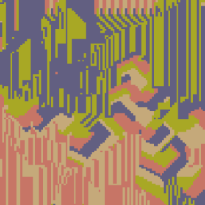

# Cyclic Cellular Automata

[Live](https://dominicktriola.com/cellular-automata)

[Documentation](./docs)

A cellular automaton simulation consists of a grid of cells. Cells have a finite number of states. Each cell’s state can change based on a simple set of rules. In this simulation every species (a cell with a distinct state — in this case color) can eat exactly one other species, and every species can be eaten by exactly one other species. When a cell is eaten it becomes the species (color) of the cell that ate it.

In terms of cellular automata jargon: species represents the number of states, resilience represents the threshold for change, and vulnerability represents a neighborhood.

